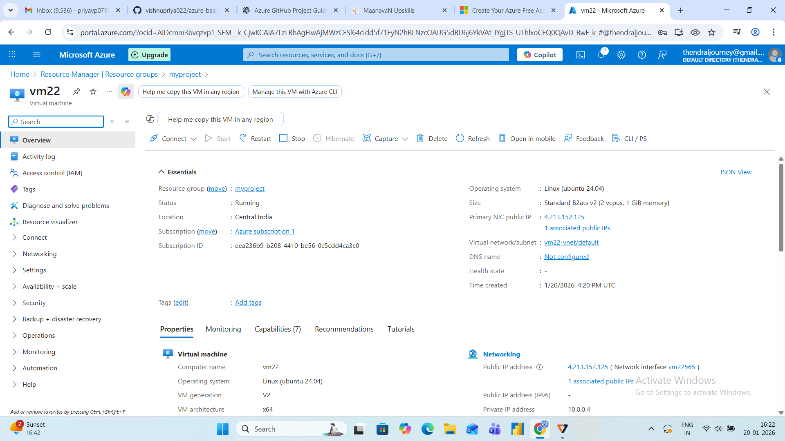
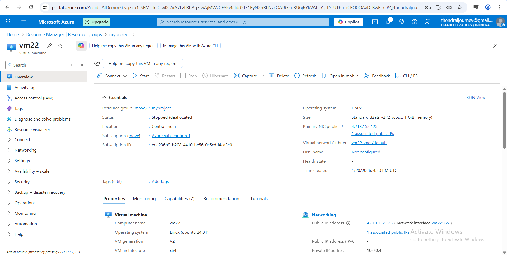

### ☁️ Project 2: Start, Stop, and Delete Azure Resources 

### 📌 Project Objective

This project shows how to start, stop, and delete Azure resources using the Azure Portal. A virtual machine was created inside a resource group, then started and stopped to understand resource status. Finally, the resource group was deleted to avoid any cost.

### 🔧 Tools Used

Microsoft Azure Portal

Azure Free Tier Account

GitHub for documentation

### 🧩 Step-by-Step Implementation

### ✅ Step 1: Create Resource Group

Resource Group Name: myproject

Region: central India

### ✅ Step 2: Create Virtual Machine

VM Name: vm22

Image: Ubuntu Server 24.04 LTS - Gen2

Size: Standard B2ats v2

Authentication: Password

✔️ VM successfully created

### ▶️ Step 3: Start Azure Virtual Machine

Go to Virtual Machines

Select: vm22

Click Start 

Wait until status shows: Running

📸 Screenshot

### ▶️ Virtual Machine Running

VM status = Running

### ⏸️ Step 4: Stop Azure Virtual Machine

Select the VM

Click Stop

Confirm stop

Status changes to: Stopped (deallocated)

📸 Screenshot

### ⏸️ Virtual Machine Stopped

VM stopped status

💡 Stopping VM saves compute cost

### ❌ Step 5: Delete Azure Resources (Zero Cost)

✅ Option 2: Delete Resource Group 

Go to Resource Groups

Select: myproject

Click Delete Resource Group

Type resource group name to confirm

✔️ All resources deleted

📸 Screenshot

### ❌ Resource Group Deleted

